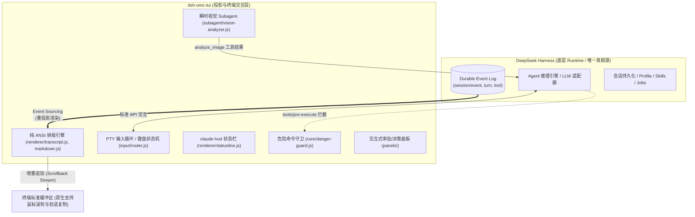

# DSH OMC TUI · 架构设计与全功能实现全景文档

本项目是 [DeepSeek Harness (DSH)](https://github.com/deepseek-ai/deepseek-harness) 的官方原生全功能终端交互界面（TUI 投影层）。本篇文档系统化总结了插件的**目录结构**、**核心设计哲学**、**所有功能特性的架构与实现细节**以及**测试工程规范**。

---

## 🏛️ 一、核心架构哲学与设计原则



### 1. 契约原则：Runtime 归 Harness，Projection 归 TUI
* **TUI 是投影层而非独立 Runtime**：会话状态、Agent 逻辑、模型列表、技能（Skills）、权限档位（Permissions）、后台任务（Jobs）和持久化配置，均以 Harness 官方服务与 durable event 为唯一真相源。
* **业务写入走官方 API**：严禁在 TUI 本地伪造状态、篡改或截断底层 durable log。
* **无状态恢复（Event Sourcing）**：恢复会话（`dsh-omc-tui -c` / `/resume`）时，所有卡片、历史对话和回顾均由持久化事件（`session/event`）重新投影构建。

### 2. 普通缓冲区追加流（Zero Alternate Screen）
* **不进入备用屏幕**：对话历史、Thinking 思考链、工具执行详情、Diff 均以增量形式直接追加到终端普通 Scrollback 缓冲区；
* **保留原生交互体验**：彻底杜绝传统 TUI 劫持滚轮事件导致误触历史的问题，**100% 保留终端原生的鼠标滚轮回看与高亮选择复制能力**。

### 3. 零重型外部 UI 库（Zero Dependencies for UI）
* 运行环境：标准 ES Modules (Node.js >= 20)；
* 严禁引入 `blessed`、`ink`、`chalk`、`cli-boxes` 等重型终端库，全套 ANSI 渲染、东亚宽字符对齐、光标控制均原生自研实现。

---

## 📁 二、项目目录结构与模块分工

```text
dsh-omc-tui/
├── bin/
│   └── dsh-omc-tui.js          # CLI 启动入口（解析 -c / --resume / --profile 等参数）
├── src/
│   ├── index.js                # TUI 核心控制器：PTY 输入循环、事件派发、调度渲染与生命周期
│   ├── renderer/               # 纯 ANSI 终端排版与渲染引擎
│   │   ├── ansi.js             # CJK 视觉宽度计算 (widthOf/visibleOf)、安全截断与字符清洗 (safe)
│   │   ├── markdown.js         # Claude Code 级别原生 Markdown 渲染器（代码卡片、Unicode 表格）
│   │   ├── themes.js           # 四阶语义化灰度与主题体系（claude / deepseek / mono / light）
│   │   ├── transcript.js       # 会话历史投影（User 气泡、Thinking 折叠、Tool Call、Diff 块）
│   │   ├── statusline.js       # claude-hud 风格全景状态栏（Token 进度、权限、Git 联动、响应速度）
│   │   ├── diff.js             # 行级红绿 Diff 差异高亮与代码块对比
│   │   ├── activity.js         # 运行中实时工具活动 HUD 动效
│   │   └── welcome.js          # 首屏引导与快捷命令卡片
│   ├── panels/                 # 交互式选择器与浮层面板
│   │   ├── approval.js         # 行内危险命令/文件修改审批卡片
│   │   ├── question.js         # ask_user_question 多 Tab 勾选决策面板
│   │   ├── file-picker.js      # @ 路径树形逐级补全与搜索面板
│   │   ├── settings-panel.js   # /settings 系统偏好交互设置面板
│   │   ├── resume-panel.js     # /resume 历史会话恢复选择器
│   │   └── jobs-panel.js       # /jobs 后台任务监控与取消面板
│   ├── commands/               # 内置斜杠命令分发与实现
│   │   ├── registry.js         # 命令统一注册与匹配调度器
│   │   ├── recap.js            # /recap 会话历史结构化回顾与空闲总结
│   │   ├── compact.js          # /compact 上下文极简压缩动效与调用
│   │   ├── btw.js              # /btw 旁路问答（不污染主上下文）
│   │   └── status.js           # /status 全局体检看板（Token 分布/健康度诊断）
│   ├── input/                  # 键盘状态机与输入协议路由
│   │   ├── router.js           # 按键事件状态机（单键/组合键/多行输入/跨平台转义）
│   │   └── clipboard.js        # macOS 剪贴板图片直读（osascript / pngpaste）
│   ├── subagent/               # 瞬时多模态子代理
│   │   └── vision-analyzer.js  # 旁路多模态视觉 Sidecar Subagent（自主按需调度）
│   └── core/                   # 安全守护与核心底层工具
│       ├── danger-guard.js     # 破坏性危险命令拦截守卫（AST 管道切分与规则拦截）
│       └── events.js           # 事件抽象与 Token 估算辅助
├── test/                       # 自动化测试集（包含 7 大单元/回归套件）
├── assets/                     # 终端界面实际运行预览图
├── README.md                   # 插件官方总览与快速入门
├── PRODUCT_SHOWCASE.md         # 详细界面预览与交互设计亮点文档
├── HARNESS_COMPATIBILITY.md    # DeepSeek Harness 契约与接口兼容说明
├── AGENTS.md                   # Agent 开发指令与工程规范
└── CHANGELOG.md                # 详细版本发布日志
```

---

## ⚡ 三、全量功能模块的设计与实现机制

### 1. 原生终端排版与 Markdown 渲染引擎 (`src/renderer/`)
* **CJK 字符安全对齐与截断 ([`ansi.js`](file:///Users/yy0812024/work/dsh-plugin/dsh-omc-tui/src/renderer/ansi.js))**：
  - 中文字符、全角符号、Emoji 在终端占用 2 个列宽，通过自研的 `widthOf()` 与 `visibleOf()` 精确测量视觉宽度，严禁使用 `.length` 直接对齐。
  - `wrap()` 算法在东亚宽字符边界自动处理折行，避免终端硬折行导致的边框撕裂。
* **高阶 Markdown 解析 ([`markdown.js`](file:///Users/yy0812024/work/dsh-plugin/dsh-omc-tui/src/renderer/markdown.js))**：
  - **闭合代码卡片**：自动绘制顶部标题栏、带行号与语法的四边闭合卡片；
  - **Unicode 表格网格**：支持 `┌┬┐├┼┤└┴┘` Unicode 连续表格绘制；
  - **行内语法**：加粗、斜体、行内代码、多级列表嵌套支持。
* **四阶灰度护眼主题体系 ([`themes.js`](file:///Users/yy0812024/work/dsh-plugin/dsh-omc-tui/src/renderer/themes.js))**：
  - 正文采用 `250` 雅致浅灰（柔和可读，杜绝高对比纯白眩光）；
  - 思维链采用 `241` 深石板灰，主色采用 Claude Terracotta 赤陶色 (`209`) 与温润琥珀金 (`214`)；
  - 支持 `claude`（默认）、`deepseek`、`mono`、`light` 四款主题热切换。

---

### 2. 破坏性危险命令防御守卫 ([`src/core/danger-guard.js`](file:///Users/yy0812024/work/dsh-plugin/dsh-omc-tui/src/core/danger-guard.js))
* **定位与触发时机**：
  - 原生挂载在 Harness Cordis 的 `tools/pre-execute` 拦截点，在任何 Shell 工具（`bash`、`shell`、`pwsh`、`exec`、`run_command` 等）真正执行前进行前置同步审查与拦截；
* **结构化 AST 分词与管道切分 (`splitShellSegments`)**：
  - 能够精准解析包含单引号 `'...'`、双引号 `"..."`、转义字符 `\`、子命令 `$()`、反引号 `` `...` `` 的复杂复合命令；
  - 自动将由 `;`、`&&`、`||`、`|`、`&` 及换行符连接的多段 Pipeline 分解为独立的命令段进行逐一审查。
* **递归解包 Subshell 嵌套 (`extractSubshells`)**：
  - 深度扫描提取包含在 `$(...)`、`` `...` ``、`<(...)`、`>(...)` 或独立括号中的内嵌子命令，防止通过子命令嵌套隐蔽执行高危行为；
  - 设置 `MAX_RECURSION_DEPTH = 32` 与 `MAX_COMMAND_LENGTH = 128 KB` 的安全边界，杜绝恶意 ReDoS 攻击与死循环展开。
* **内置高危命令防御矩阵 (`DEFAULT_DANGER_RULES`)**：
  - **文件破坏**：`rm -rf /`、`rm -rf /*`、`rm -rf /.`、`rm -rf ~`、`rm -rf $HOME` 根目录与主目录递归销毁；
  - **拒绝服务**：Fork 炸弹（`:(){ :|:& };:` / `fork(){ fork|fork& };fork`）；
  - **磁盘与设备破坏**：`mkfs`、`fdisk`、`parted` 格式化以及 `dd of=/dev/sd*` 设备直写；
  - **代码与权限风险**：`git push -f` / `--force` 强制推送覆盖、`chmod -R 777 /` 危险全盘提权。
* **用户级自定义规则与白名单扩展**：
  - 自动读取工作区 `.dsh/danger-rules.json`（或全局配置）；
  - 支持 `block` 正则数组灵活扩展自定义拦截规则；
  - 支持段级 `allow` 白名单规则精准放行安全命令；
  - 支持通过环境变量 `DSH_DANGER_GUARD=off` 一键旁路关闭守卫。

---

### 3. claude-hud 风格全景上下文状态栏 ([`src/renderer/statusline.js`](file:///Users/yy0812024/work/dsh-plugin/dsh-omc-tui/src/renderer/statusline.js))
* **设计意图**：借鉴深受好评的 `claude-hud` 架构，为开发者提供高信息密度、低视觉噪音的全局运行时指示器。
* **全景指示器矩阵**：
  1. **模型与会话状态**：实时展示当前活跃模型（如 `[deepseek-v4-flash]`）、Build/Plan 运行模式、Reasoning Effort 档位（`HIGH`/`DEFAULT`）、当前会话摘要标题与探索动效（`◉ reading...`）；
  2. **Token 上下文吞吐与智能水位预警**：
     - 动态渲染高可读性 Token 进度条（`Context ██████░░░░ 45%`）；
     - 60% 绿色正常、75% 琥珀黄预警、80% 珊瑚红严重告警（⚠️ 标识），并自动联动 Harness 的 85% 自动 Compact 机制；
     - 支持 `percent`、`tokens`、`remaining`（剩余可用）及 `both` 四种显示模式。
  3. **Git 仓库动态感知**：
     - 实时抓取当前 Git 分支名；
     - 动态标识暂存区（`+`）、未暂存工作区脏标记（`*`）；
     - 感知相对远端仓库的提交偏差（如 `↑2` 领先 / `↓1` 落后）。
  4. **生成速率与耗时度量**：
     - 实时展示上一轮交互响应耗时（如 `⏱️ 1.8s`）；
     - 精确计算瞬时 Token 生成速率（如 `⚡ 42.5 tok/s`）。
  5. **扩展生态与后台任务联动**：
     - 统计当前会话挂载的 Skills 数量、MCP Servers 数量与 Hook Bridges 数量；
     - 实时感知活跃的 Background Jobs，并在状态栏动态轮播任务运行时长（如 `1 active · 12s`）。
  6. **权限档位与交互提示**：醒目指示当前权限等级（如 `workspace-write`），提示 `Shift+Tab` 单键无缝循环轮换。
* **高吞吐 Memoization 缓存性能**：
  - 基于高维复合键（`statusRowsCache`）实现毫秒级缓存，在用户高速输入与空闲静止帧时状态栏渲染开销降至 0ms。
* **自适应密度调节**：
  - `detailed`：全景展开所有指示器（宽屏推荐）；
  - `compact`：双行精简布局，合并上下文与权限指示；
  - `minimal`：单行极简胶囊，专为小窗或分屏终端设计。

---

### 4. 双模态视觉架构与高分屏缩放引擎 (`src/vision-router.js` & `src/image-protocol.js`)
* **痛点**：
  1. 高分屏（Retina）截图单边像素极易超过 2048px 甚至达到 4000+px，直接发送会触发模型/Harness 像素上限报错；
  2. 当主模型为原生多模态模型（如 GPT-4o、Claude 3.5 Sonnet、Qwen-VL）时，强行使用子代理会导致响应变慢且浪费上下文；而当主模型为纯文本模型（如 DeepSeek-V3/R1、DeepSeek V4）时，直接塞入原生图片块会导致模型报错。
* **架构实现**：
  1. **Retina 高分屏安全缩放引擎 (`src/image-protocol.js`)**：
     - 内置 `MAX_SAFE_IMAGE_PIXELS = 2048` 安全基准线；
     - 原生零外部 UI 依赖：macOS 优先调用系统自带 `sips`，Linux / Windows 自动检测 `magick` / `convert` / `gm` 图像工具链，缺少工具时精准返回友好指引；
     - 原生二进制解析：内置 `jpegDimensions` 与 `pngDimensions`，自动保持 `image/jpeg` 与 `image/png` 原生 MIME 与尺寸；
     - 缩放后元数据原子一致性：自动更新 `dimensions`（`width/height`）、基于新 Buffer 实时重新生成 `base64`，并清空指向旧原图的 `filePath`。
  2. **双模态智能分流路由 (`resolveModelVisionSupport`)**：
     - **严格元数据判定**：基于 Harness LLM Service 的 `inputModalities` 与 `capabilities.vision` 判定模型视觉能力，严格比对 `provider + model` 杜绝跨供应商同名模型污染；
     - **纯文本零查询优化**：仅在包含待发送图片（`images.length > 0`）时才查询模型目录，纯文本消息完全跳过，杜绝远程 Provider 网络延迟阻塞日常对话；
     - **原生多模态直识**：若当前模型支持原生视觉，消息体直接注入 `{ type: 'image', attachment: ref }` 原生图像块，由主模型直接识别；
     - **纯文本模型 Sidecar 降级**：若当前模型为纯文本/代码模型，图片登记为 Durable Attachment，由主 Agent 自主按需调度 `analyze_image` 旁路子代理进行 OCR 与 UI 结构化提取。

---

### 5. 会话历史回顾与空闲自动总结 (`/recap`) (`src/commands/recap.js`)
* **历史结构化提取算法 (`buildSessionRecapSummary`)**：
  - 从 `turn/end`、`user/message`、`tool/call` durable events 中提取用户主要目标、已触达并修改的核心文件清单、耗时统计与轮次信息；
  - 严格清洗 ANSI 控制序列与多余空白，生成精炼的结构化回顾。
* **15 分钟空闲自动回顾**：
  - 本轮交互结束后启动 15 分钟空闲定时器；若无新操作，在终端自动打印 `※ recap: ...` 呼吸回顾；
  - 支持在 `/settings` 偏好设置中一键开启/关闭 `autoRecap`。
* **独立 localId/localKey 与 200 条上限约束**：
  - 本地日志通过 `appendLocalLogEntry` 统一写入，分配全局递增的 `localId` 与 `localKey`，与 durable event 的整数 seq 彻底解耦，杜绝序号碰撞；
  - 严格限制 `localLog` 最多保留 200 条，保障长时间会话重绘性能。

---

### 6. 行内安全审批卡片与交互式决策面板 (`src/panels/`)
* **行内安全审批卡片 ([`approval.js`](file:///Users/yy0812024/work/dsh-plugin/dsh-omc-tui/src/panels/approval.js))**：
  - 拦截危险 Shell 命令执行与文件写入；
  - 使用 [`diff.js`](file:///Users/yy0812024/work/dsh-plugin/dsh-omc-tui/src/renderer/diff.js) 直接在终端渲染行级红绿 Diff 对比；
  - 支持 `y` 允许、`n` 拒绝、`a` 永久信任等单键快速响应。
* **多选项决策面板 ([`question.js`](file:///Users/yy0812024/work/dsh-plugin/dsh-omc-tui/src/panels/question.js))**：
  - 捕获 Harness 的 `ask_user_question` 请求；
  - 提供多 Tab 勾选状态指示、明细审查与单键提交。

---

### 7. 内置斜杠命令系统矩阵 (`src/commands/`)

| 斜杠命令 | 核心功能与实现机制 |
| :--- | :--- |
| `/recap` | 手动生成当前会话历史回顾（带 YOU 气泡与答案卡片），并同步更新防重序号 |
| `/btw <q>` | **旁路问答**：拉起隔离的沙盒临时会话回答突发提问，**绝不污染主会话上下文** |
| `/compact` | 调用 Harness 上下文压缩 API，并配合轻量点阵加载动效 |
| `/status` | **全局体检看板**：统计 Token 消耗比例分布、配置健康度、各组件加载状态 |
| `/settings` | 交互式系统偏好设置面板（主题切换、自动回顾开关、历史持久化） |
| `/model` | 列出并热切换当前 profile 下所有可用 LLM 模型 |
| `/vision` | 查看推荐并绑定子代理旁路视觉多模态模型 |
| `/resume` | 交互式选择并恢复历史会话（基于 durable events 完整重建） |
| `/jobs` | 监控后台异步任务，支持单键终止指定任务 |
| `/steer` | 在 Agent 执行多步任务中途动态注入微调指令 |

---

### 8. 输入路由与工作区感知 (`src/input/`)
* **`@` 树形路径逐级补全 ([`file-picker.js`](file:///Users/yy0812024/work/dsh-plugin/dsh-omc-tui/src/panels/file-picker.js))**：支持在输入框输入 `@` 时弹出交互式文件树，支持模糊搜索与子目录钻取；
* **`!` 本地 Shell 命令直通**：以 `!` 开头直接在本地工作区执行命令，并将输出无缝作为上下文提供给模型；
* **异常恢复与状态保护**：提交失败（文件展开异常、网络中断、取消提交）时自动保留输入并恢复计时器，绝不丢失用户编辑内容。

---

## 🧪 四、测试体系与工程规范

### 1. 自动化测试套件
项目配备纯原生 ESM 的 7 大回归测试套件，执行 `npm test` 即可全量验证：
1. `test/transcript-projection.test.mjs`：会话投影与块构建测试；
2. `test/screen-viewport.test.mjs`：视口渲染与滚动边界测试；
3. `test/input-router.test.mjs`：键盘路由与状态机测试；
4. `test/mouse-selection.test.mjs`：鼠标选区与剪贴板测试；
5. `test/unit-regressions.mjs`：70+ 核心业务回归测试（包含 recap 序号单调性、跨整数边界、200 上限、异常恢复等）。

### 2. 模块完整性校验
```bash
npm run verify
# 验证 index.js, themes.js, registry.js 等核心模块 ESM 导出完整性
```
