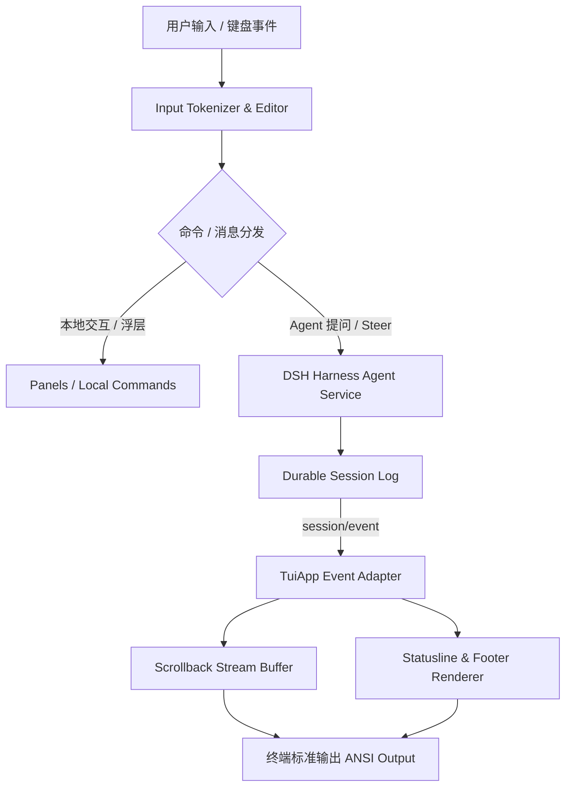

# DSH OMC (Oh-My-Claude TUI) · 产品亮点与设计白皮书

> **产品定位**：面向 [DeepSeek Harness](https://github.com/deepseek-ai/deepseek-harness) 的下一代键盘优先（Keyboard-First）原生 ANSI 终端 Coding Agent 交互界面。致敬并对标 Claude Code 交互哲学，追求极致流畅、零眩光、沉浸式开发体验。

---

## 🌟 核心视觉预览 (Product Previews)

### 1. 沉浸式编码主界面 (Hero Stream & Diff View)

*图 1：DSH OMC 终端主界面 · 0ms 即时渲染欢迎卡片、折叠式思维链（Thinking）、流式语法高亮与行级红绿 Diff 预览*

### 2. 交互式审批与文件上下文补全 (Interactive Modals & `@` Completion)

*图 2：行内安全审批卡片（Approval Card）与 `@` 逐级工作区文件路径自动补全浮层*

---

## 💡 产品设计哲学与 6 大核心亮点 (Key Highlights)

### 1. 彻底摆脱全帧清屏：追加式普通缓冲区（Zero Alternate Screen）
- **痛点**：传统 TUI（如部分 Webview / 备用屏幕全屏应用）会拦截或扭曲终端的原生鼠标行为。在 VS Code 中，滚轮常被错误映射为方向键触发历史切换，且无法使用鼠标原生高亮划选和快速复制。
- **解法**：DSH OMC 采用 **追加式普通缓冲区（Scrollback Stream）**。已完成的消息、代码块和工具执行结果实时追加至终端历史，仅将输入框与 4 行状态指示器固定于底部。
- **价值**：**完全保留终端原生滚轮回看与多行划选复制能力**，像使用经典 Unix 工具一样轻快自然。

---

### 2. 护眼四阶灰度与 Claude 暖色调体系 (Anti-Glare Aesthetics)
- **痛点**：长时间注视传统终端高亮白光（`\x1b[37m`）极易造成视疲劳与眩光感。
- **解法**：建立柔和四阶灰度层次：
  - **正文回答**：`250` 雅致浅灰（柔和可读，消除眩光）；
  - **标签/高亮**：`251` 柔和亮灰白；
  - **代码/细节**：`245` 中灰；
  - **Thinking 思维链**：`241` 深石板灰（低对比度背景流动）。
- **主题支持**：内置 `claude`（暖色调沙色/杏色/赤陶色）、`deepseek`（科技蓝）、`mono`（单色）与 `light`（明亮）四款调优调色板，一键通过 `/settings` 切换。

---

### 3. 思维链动态折叠与一键穿透（Thinking Fold & `Ctrl+O`）
- **流式阶段**：实时呈现动态平滑点阵动画 `⠋ Thinking... (1.2s · ↓ tokens)`，降低用户等待焦虑。
- **收尾折叠**：回答完成后自动折叠为紧凑徽标 `✻ thinking · 18 lines · 1.2s`，保持对话区清爽。
- **全屏穿透**：按下 `Ctrl+O` 快捷键，当前会话中的所有思考链与并行工具组一键全部展开；再次按下全部收起。

---

### 4. 极致的上下文交互：`@` 文件引用与双图形协议图片粘贴
- **`@` 路径逐级补全**：输入 `@` 即可唤起当前工作区目录树。支持实时字符过滤、`Enter` 下钻目录或选定文件、`Esc` 返回上级。提交时自动读取文件并格式化为语言代码块注入 Prompt，对话区回显仅保留优雅的 `@path`，不产生文本刷屏。
- **图片双协议原生解析**：支持通过 `Cmd/Ctrl+V` 直接粘贴图片，底层状态机自动解析 **iTerm2 OSC 1337** 与 **Kitty Graphics** 双协议，经 Harness 官方 attachment 服务落盘入库。针对纯文本模型自动降级为文本占位符，防止接口 400 报错。

---

### 5. 零污染轻量级侧边提问：`/ask <query>`
- **痛点**：在编写主任务代码时，偶尔需要临时询问一个简单概念或语法，直接提问会污染主任务会话历史并浪费大量上下文 Token。
- **解法**：`/ask` 命令在后台创建一个独立的 `ephemeral` 临时会话，模型作答完毕后立即销毁会话。主任务上下文不受任何影响。

---

### 6. 全景四行状态指示器与实时诊断（Statusline & `/status`）
- **第 1 行（身份）**：`BUILD/PLAN 模式 | [模型名称] | 当前目录 | 会话标题`，动态探索动画（`◉ Exploring`）；
- **第 2 行（上下文经济学）**：块状动态进度条 `█████░░░░░░░░░ 38%`、In / Out / Cache 命中率；
- **第 3 行（生态看板）**：Prompt 类型、已挂载 Skills 数、MCP 服务数、Hook 拦截点、最近工具结果、后台运行中 Jobs；
- **第 4 行（权限控制）**：当前权限预设（`workspace-write` / `readonly` 等），支持 `Shift+Tab` 一键轮转。

---

## 🧭 功能架构与命令矩阵 (Command & Feature Matrix)

| 命令 / 快捷键 | 功能分类 | 产品描述与价值 |
| :--- | :--- | :--- |
| `Enter` | 基础交互 | 发送消息；命令菜单打开时执行选中项 |
| `Ctrl+J` | 编辑器 | 在当前输入框内无缝换行 |
| `Ctrl+C` | 运行干预 | 运行中安全中断当前回合（保留已生成文本）；空闲时退出 |
| `Esc` | 交互撤销 | 运行中即时中断；空闲时清空输入或关闭当前浮层面板 |
| `Ctrl+O` | 视图展开 | 一键展开 / 收起全会话的 Thinking 思考全文及并行工具组 |
| `Ctrl+G` | 外部编辑 | 调用 `$EDITOR`（如 VS Code / Vim）编辑多行复杂 Prompt |
| `Ctrl+F` / `Ctrl+R`| 历史搜索 | 打开交互式历史提示词模糊搜索面板 |
| `Shift+Tab` | 权限控制 | 在只读、工作区读写、全权限模式之间持久化轮转 |
| `!` + 命令 | 本地 Bash | 进入绿色 Bash 模式，直接在本地执行 Shell 命令并捕获输出日志 |
| `/ask <问题>` | 辅助查询 | 隔离侧边提问，不污染主会话上下文与 Token 预算 |
| `/compact` | 上下文优化 | 对齐 Claude Code 的平滑压缩，防重入锁与 Token 节省统计 |
| `/steer` | 动态干预 | 运行时干预模型方向，或一键提拔已排队消息为实时指示 |
| `/model` | 模型管理 | 两步式模型选择器（Provider → Model → 思考档位） |
| `/preset` | Agent 预设 | 空白会话直接选择，产生内容后切换自动弹出二次确认面板 |
| `/jobs` | 任务管理 | 监控后台异步长任务，支持游标读取输出、`k` 取消、`r` 刷新 |
| `/status` | 系统看板 | 输出模型、会话、Token 分布、扩展组件与运行态体检报告 |
| `/settings` | 本地偏好 | 交互式配置主题配色与状态栏密度（Detailed / Compact / Minimal） |

---

## 🏗️ 架构合规与技术契约 (Architecture & SSOT)

1. **纯粹的 Cordis 依赖注入**：严禁静态 import `@deepseek-ai/*`，依赖解析与宿主环境完全解耦；
2. **单一真相源（SSOT）**：会话历史、权限、Token 用量全部以 Harness durable event 为准，UI 本地只保留纯粹的渲染状态；
3. **分层节流与 Memoization**：Token 流式批处理（56ms）与状态栏 Key 缓存，保证极高吞吐下的无卡顿、无闪烁体验。
