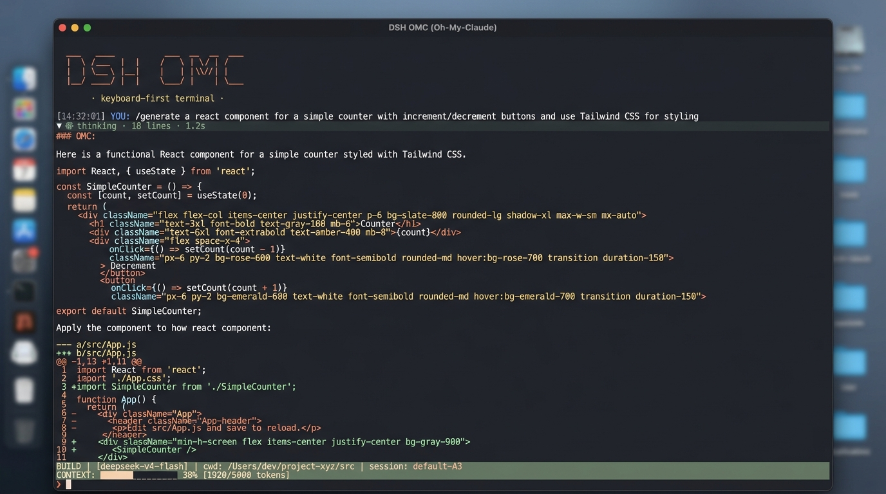
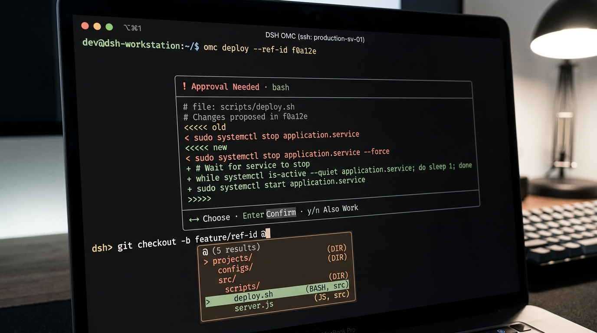

# DSH OMC (Oh-My-Claude TUI)

<div align="center">

[](https://dshhub.org/#catalog)
[](LICENSE)
[](https://github.com/deepseek-ai/deepseek-harness)
[](package.json)
[](README.md)

**Keyboard-First 原生 ANSI 交互终端 · 致敬并对标 Claude Code 交互哲学**

[产品白皮书与设计亮点](PRODUCT_SHOWCASE.md) · [Harness 兼容性契约](HARNESS_COMPATIBILITY.md) · [发布路线图](ROADMAP.md)

</div>

---

## 📸 运行界面概览

<div align="center">


*DSH OMC 沉浸式终端界面：0ms 欢迎卡片、思维链动态折叠（`Ctrl+O` 穿透）、流式语法高亮与行级红绿 Diff*

</div>

---

## ⚡ 快速安装与启动

### 1. 从公开 GitHub 仓库安装 (推荐)

```sh
npx --yes @deepseek-ai/dsh@latest plugin --profile tui add github:ipromise2021/dsh-omc-tui
npx --yes @deepseek-ai/dsh@latest --profile tui
```

### 2. 本地开发与调试安装

```sh
# 始终在隔离 DSH_HOME 目录中进行开发调试
export DSH_HOME=/private/tmp/dsh-tui-dev
npx --yes @deepseek-ai/dsh@latest plugin --profile tui add /absolute/path/to/dsh-omc-tui
npx --yes @deepseek-ai/dsh@latest --profile tui
```

`dsh plugin` 会在 `$DSH_HOME/profiles/tui` 下注册 profile，并将声明了 `dsh.bundle` 的本包追加进 bundle 栈，由底层 `dsh-base` 继续提供模型、持久化、工具与 sandbox 支持。

---

## 🌟 核心特性一览

<div align="center">


*行内安全审批卡片与 `@` 逐级工作区文件路径补全*

</div>

- 🚀 **追加式普通缓冲区（Zero Alternate Screen）**：主对话增量追加至终端原生 Scrollback，输入框与 Statusline 驻留末尾。**完全保留 VS Code / 终端原生鼠标滚轮与拖拽复制**。
- 🎨 **护眼四阶灰度层次**：精细调优的 4 阶灰度调色板（250 雅致浅灰正文、251 柔和高亮、245 中灰代码、241 深石板灰 Thinking），消除终端眩光；内置 `claude`、`deepseek`、`mono`、`light` 四款主题。
- 📁 **`@` 文件逐级路径补全**：实时目录树过滤，`Enter` 选定或下钻，提交时自动展开为带语法标签的代码块；回显仅保留紧凑的 `@path`。
- 🖼️ **双图形协议图片粘贴**：`Cmd/Ctrl+V` 原生捕获 iTerm2 OSC 1337 与 Kitty Graphics 图像序列，经官方 `attachments` 校验落盘。
- ⚡ **零上下文污染侧边提问（`/ask`）**：在独立 ephemeral 会话中快速执行轻量提问，完全不污染主任务 Session Context。
- 🛡️ **`approval/request` 行内安全审批**：行级红绿 Diff 预览、`Y`/`N` 快速单键审批、队列串行化处理。
- ✻ **Thinking 动态折叠与一键穿透**：流式阶段动态动画，完成后收起为统计徽标；`Ctrl+O` 一键展开/收起全会话思考全文与并行工具组。
- 📊 **四行全景 Statusline 与 `/status` 看板**：实时展示 Model、Effort、Token 块状进度条（`████░░░ 38%`）、Cache 命中率、MCP、Skills、Hooks 与后台 Jobs。
- 🐚 **`!` 本地 Bash 模式**：输入 `!` 边框变绿，直接在本地执行 Shell 命令并逐行回显输出。

---

## ⌨️ 快捷键速查表

| 按键 | 对应动作 | 说明 |
| :--- | :--- | :--- |
| `Enter` | **发送 / 确认** | 发送输入内容；命令菜单/面板打开时选定执行 |
| `Ctrl+J` | **换行** | 在输入框内插入真实换行符 |
| `Ctrl+C` | **中断 / 退出** | 运行中中断当前回合（保留已生成内容）；空闲时退出 |
| `Esc` | **取消 / 返回** | 运行中中断；空闲时清空输入、关闭浮层或清除选区 |
| `Ctrl+O` | **展开 / 折叠** | 一键展开 / 收起全会话的 Thinking 思考全文及并行工具组 |
| `Ctrl+G` | **外部编辑器** | 使用系统 `$EDITOR`（Vim / VS Code 等）编辑长 Prompt |
| `Ctrl+F` / `Ctrl+R` | **历史搜索** | 打开交互式输入提示词模糊搜索面板 |
| `Ctrl+P` | **命令面板** | 快速过滤并运行任意命令或 Skill |
| `Shift+Tab` | **权限切换** | 在只读、工作区读写、全权限预设间无缝轮转 |
| `Ctrl+A` / `Ctrl+E` | **行首 / 行尾** | 光标快速跳至当前行首或行尾 |
| `Alt+←` / `Alt+→` | **按词跳跃** | 按单词粒度左右移动光标 |
| `Ctrl+W` | **删除词** | 删除光标前的一个单词 |
| `Ctrl+U` | **清空输入** | 一键清空输入框内容 |
| `!` + 命令 | **Bash 模式** | 本地直接执行 Shell 命令并捕获回显 |
| `@` | **文件引用** | 打开工作区文件与目录浏览补全面板 |
| `?` | **帮助菜单** | 空输入时打开/关闭快捷键提示卡片 |

---

## 🛠️ 命令体系目录

- **会话与流式**：`/help`、`/clear`（仅清视图，保留上下文）、`/recap`（本地统计）、`/export`（导出 Markdown）、`/exit`。
- **模型与预设**：`/model`（两步式模型与推理档位切换）、`/effort`（动态思考预算）、`/preset`（Agent 预设组合）、`/plan`（切换 plan/build 模式）。
- **诊断与配置**：`/status`（系统看板与诊断看板）、`/context`（Token 占用分析）、`/settings`（主题与 Statusline 密度配置）、`/rename`（重命名会话）。
- **辅助与干预**：`/ask <问题>`（隔离侧边临时问答）、`/steer`（运行中动态干预）、`/compact`（平滑上下文压缩）、`/resume`（会话选择器）。
- **扩展与生态**：`/skills`（技能浏览）、`/grill-me`（架构深度拷问技能）、`/jobs`（后台任务看板）、`/mcp`（MCP 状态）、`/hooks`（Hook 桥接）。

---

## 🔌 MCP 服务器与 Hooks 配置

### 1. MCP 服务器配置 (`cordis.patch.yml`)
在 profile 补丁层配置标准 `@deepseek-ai/dsh-mcp-client`：

```yaml
- insert:
    # 浏览器自动化 MCP
    - id: mcp-browser
      name: '@deepseek-ai/dsh-mcp-client'
      config:
        serverName: browser
        transport: stdio
        command: npx
        args: ['-y', '@playwright/mcp']

    # 本地 MySQL 数据库 MCP
    - id: mcp-mysql
      name: '@deepseek-ai/dsh-mcp-client'
      config:
        serverName: mysql
        transport: streamable-http
        url: http://localhost:3307/mcp
```

### 2. Claude Code 风格 Hooks
```yaml
- insert:
    - id: hooks-cc
      name: '@deepseek-ai/dsh-hooks-claude-code'
      config:
        configPath: ./.claude/hooks.json
```

---

## 🧪 自动化测试套件

本项目提供了完整的无凭据 Mock 环境与 PTY 端到端测试套件：

```sh
# 运行全套 PTY E2E 回归测试
python3 test/pty-e2e.py        /tmp/e2e.log        # 流式/审批/usage/权限/中断/退出
python3 test/pty-resume.py     /tmp/resume.log     # /compact/窄终端/会话恢复
python3 test/pty-image.py      /tmp/image.log      # OSC 1337 / Kitty 图片粘贴→attachment
python3 test/pty-file.py       /tmp/file.log       # @ 引用目录浏览与代码块展开
python3 test/pty-features.py   /tmp/features.log   # 审批 diff/推理折叠/工具组/模型切换
python3 test/pty-interaction.py /tmp/interaction.log # 菜单/快捷键/多行输入/状态行
```

---

## 📄 开源许可证

本项目基于 [MIT License](LICENSE) 开源发布。
