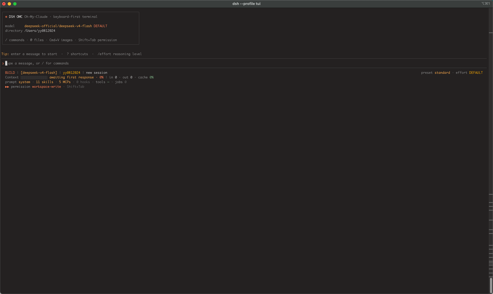

# DSH OMC (Oh-My-Claude TUI)

<div align="center">

[](https://github.com/ipromise2021/dsh-omc-tui)
[](LICENSE)
[](https://github.com/deepseek-ai/deepseek-harness)
[](package.json)
[](README.md)

**个人学习与探索项目 · 采用 Claude Code CLI 风格的 DeepSeek Harness 终端界面**

[设计心得与功能记录](PRODUCT_SHOWCASE.md) · [Harness 兼容性记录](HARNESS_COMPATIBILITY.md) · [开发路线与缺陷清单](ROADMAP.md)

</div>

---

## 📸 运行界面概览 (Actual Terminal Interface)

<div align="center">


*DSH OMC 终端启动截图：欢迎卡片、4 行 Statusline 状态指示器与护眼调色板*

</div>

---

## ✨ 特性速览 (Features at a Glance)

| 特性 | 一句话说明 |
| :--- | :--- |
| 🚀 **零备用屏幕** | 追加式普通缓冲区（Scrollback Stream），原生滚轮回看与划选复制 |
| 📁 **`@` 文件补全** | 路径逐级下钻 + 代码块智能展开，单文件超 16KB 自动截断 |
| 🛡️ **行内安全审批** | 红绿 Diff 预览 + `Y`/`N` 单键决策，支持审批队列串行处理 |
| 📊 **四行 Statusline** | 身份 / Token / 生态 / 权限四行全景，`/status` 一键体检 |
| 🎨 **护眼调色板** | 四阶柔和灰度 + `claude` / `deepseek` / `mono` / `light` 四款主题热切换 |
| 🖼️ **图片粘贴** | iTerm2 OSC 1337 + Kitty Graphics，自动转官方 Attachment 管道 |
| ⚡ **`/ask` 侧问** | 独立临时会话作答，不污染主任务 Context 与 Token 预算 |
| 🐚 **`!` Bash / `/jobs`** | 本地 Shell 直执行，后台任务面板查看输出与取消 |

---

## 📖 项目背景与初心 (Background)

`dsh-omc-tui` (Oh-My-Claude) 是我作为一名开发者，在学习和探索 [DeepSeek Harness (DSH)](https://github.com/deepseek-ai/deepseek-harness) 底层架构与封装能力时写的一个终端 TUI 插件。

平时写代码时我个人非常喜欢使用 **Claude Code CLI**，很喜欢它那种清爽、轻快、键盘优先（Keyboard-First）的交互质感。在研究 DSH 时，发现 DSH 底层封装了非常强大的 Cordis 服务组合、Durable Session 事件流、工具调度与审批机制，于是萌生了自己动手写一个终端界面的想法：

- **方便日常调用**：让自己可以在熟悉的纯终端环境里，顺手调用 DSH 封装的各类 Agent、会话、工具与审批能力；
- **实现喜欢的交互**：尝试在终端中做出自己用着最舒服的体验（比如坚持不进备用屏幕以保留终端原生滚轮、调教柔和四阶灰度消除白光刺眼感、实现 `@` 文件逐层补全与 Thinking 折叠等）；
- **学习与探索**：纯粹出于个人技术探索与日常顺手使用的目的，代码和功能都在边用边完善中。也非常欢迎喜欢终端 Coding 的朋友一起交流探讨。

---

## ✅ 环境要求 (Requirements)

| 依赖 | 版本 / 说明 |
| :--- | :--- |
| Node.js | `v20+` / `v22+`（以 `package.json` engines 为准） |
| DeepSeek Harness | `^0.1.0-rc.6`（以 `peerDependencies` 为准） |
| 终端 | 支持 ANSI 256 色即可（VS Code / iTerm2 / 原生 Terminal 等） |
| 图片粘贴（可选） | iTerm2（OSC 1337）或支持 Kitty Graphics 的终端 |

---

## ⚡ 快速开始与安装 (Installation & Usage)

### 1. 从公开 GitHub 仓库安装 (推荐)

```sh
# 1. 将 dsh-omc-tui 添加至 tui profile
npx --yes @deepseek-ai/dsh@latest plugin --profile tui add github:ipromise2021/dsh-omc-tui

# 2. 启动 tui profile
npx --yes @deepseek-ai/dsh@latest --profile tui
```

### 2. 本地开发与调试安装

```sh
# 推荐在隔离的 DSH_HOME 目录中进行调试，避免改写 ~/.dsh
export DSH_HOME=/private/tmp/dsh-tui-dev

# 挂载本地代码路径
npx --yes @deepseek-ai/dsh@latest plugin --profile tui add /absolute/path/to/dsh-omc-tui

# 启动调试会话
npx --yes @deepseek-ai/dsh@latest --profile tui
```

`dsh plugin` 会在 `$DSH_HOME/profiles/tui` 下注册 profile，并将声明了 `dsh.bundle` 的本包追加进 bundle 栈，由底层 `dsh-base` 继续提供模型、持久化、工具、审批与 sandbox 支持。

---

## 🌟 核心功能深度解析 (Detailed Features)

### 1. 🚀 追加式普通缓冲区（Zero Alternate Screen）与 流式 Markdown / Diff 渲染
- **绝不进入备用屏幕**：摒弃传统全屏清屏（`CSI ?1049h`），所有已完成的对话消息、工具调用、思考过程与 Diff 结果直接追加至终端原生 Scrollback 历史。
- **原生滚轮与鼠标选择**：在 VS Code 终端或 iTerm2 中，鼠标滚轮可自如向上回看历史，鼠标可随意框选多行文本并直接复制，绝不会误触发 `↑/↓` 历史提示词切换。

---

### 2. 📁 `@` 路径逐级下钻补全与代码块智能展开
- **交互补全**：输入 `@` 默认列出当前工作目录的一级目录与文件。支持字符模糊过滤、`↑↓` 快速选定、`Enter` 钻入子目录或选中文件、`Esc`/`Backspace` 返回上级目录。
- **上下文展开**：提交时自动读取选中文件内容，并按文件后缀生成带 Markdown 语言标签的代码块注入模型 Prompt（单文件超过 16KB 自动保护截断）。
- **紧凑回显**：对话区回显仅保留紧凑的 `@path`，彻底避免超长文件内容刷屏。

---

### 3. 🛡️ `approval/request` 行内安全审批
- **行级红绿 Diff 预览**：当模型执行文件修改或危险命令时，审批卡片清晰展示文件名与 `-/+` 行级色彩差异。
- **单键快速决策**：支持 `Y`（允许一次）、`N` / `Esc`（拒绝），支持队列串行处理，审批前预输入的字符会自动消费。

---

### 4. 📊 四行全景 Statusline 与 `/status` 诊断看板
- **第 1 行（身份）**：`BUILD/PLAN 模式 | [模型名] | 工作目录 | 会话标题`，带动态探索状态（`◉ Exploring`）；
- **第 2 行（Token 经济学）**：块状进度条 `█████░░░░░░░░░ 38%`、In / Out / Cache 实时命中率；
- **第 3 行（生态看板）**：已挂载 Skills 数、MCP 服务数、Hook 拦截点、最近工具结果、后台 Jobs 计数；
- **第 4 行（权限指示）**：当前权限预设（`workspace-write` 等），支持 `Shift+Tab` 一键轮转；
- **`/status` 命令**：一键输出环境、Token 占用分布、扩展组件与运行态全局体检报告。

---

### 5. 🎨 护眼四阶灰度与 Claude 暖色调体系
- **消除眩光感**：经过反复目视调校的四阶柔和灰度：
  - **正文回答**：`250` 雅致浅灰（柔和高可读性）；
  - **标签/高亮**：`251` 亮白微光；
  - **代码/边界**：`245` 中灰；
  - **Thinking 思维链**：`241` 深石板灰。
- **四款调色板**：内置 `claude`（暖赤陶/琥珀金）、`deepseek`（经典科技蓝）、`mono`（纯黑白极简）、`light`（明亮浅色），支持通过 `/settings` 实时热切换并持久化至 `$DSH_HOME/settings.yaml`（默认 `~/.dsh/settings.yaml`）。

---

### 6. 🖼️ 双图形协议终端图片粘贴
- **iTerm2 OSC 1337 + Kitty Graphics**：支持通过 `Cmd/Ctrl+V` 将剪贴板中的图片直接粘贴至终端。
- **官方 Attachment 管道**：底层状态机自动捕获图像二进制并转存为官方 Attachment Ref，随消息提交。对纯文本模型自动降级为友好占位符，避免接口 400 异常。

---

### 7. ⚡ 零污染侧边临时提问（`/ask <query>`）
- 在执行复杂代码任务时，可使用 `/ask <问题>` 进行临时概念查询（如 `/ask JS Map 遍历效率`）。
- 系统在后台创建独立的临时会话作答，**完全不污染主任务 Session Context，不浪费主任务 Token 预算**。

---

### 8. 🐚 `!` 本地 Bash 快速执行与后台任务（`/jobs`）
- 输入 `!` 时输入框边框高亮变绿，`Enter` 直接在本地宿主 Shell 中执行命令，输出逐行持久化输出到对话日志中（支持 `Ctrl+B` 一键转入后台执行）。
- 基于官方 `ctx.jobs` 构建的任务面板，支持列出任务状态、游标读取实时输出、`k` 请求取消、`r` 刷新，不伪造虚假进度。

---

## ⌨️ 完整快捷键速查表 (Keybindings)

| 按键 / 快捷键 | 对应动作 | 交互说明 |
| :--- | :--- | :--- |
| `Enter` | **发送 / 选定** | 发送输入框内容；菜单/面板打开时选定执行 |
| `Ctrl+J` | **换行** | 在输入框内插入真实多行换行符 |
| `Ctrl+C` | **中断 / 退出** | 模型运行中安全中断回合（保留已生成文本）；空闲时退出 |
| `Esc` | **取消 / 中断** | 运行中即时中断；空闲时清空输入或关闭当前浮层面板 |
| `Ctrl+O` | **展开 / 折叠** | 一键展开 / 收起全会话的 Thinking 思考全文及并行工具组 |
| `Ctrl+G` | **外部编辑器** | 调用系统 `$EDITOR`（如 VS Code / Vim）编辑复杂 Prompt |
| `Ctrl+F` / `Ctrl+R` | **历史搜索** | 打开交互式输入提示词模糊搜索面板 |
| `Ctrl+P` | **命令面板** | 快速过滤并运行任意 Command 或 Skill |
| `Shift+Tab` | **权限轮转** | 在只读、工作区读写、全权限预设间无缝切换并落盘 |
| `Ctrl+A` / `Ctrl+E` | **行首 / 行尾** | 光标快速跳至当前行首或行尾 |
| `Alt+←` / `Alt+→` | **按词跳跃** | 按单词粒度左右快速移动光标 |
| `Ctrl+W` | **删除词** | 快速删除光标前的一个完整单词 |
| `Ctrl+U` | **清空输入** | 一键清空当前输入框 |
| `!` + 命令 | **Bash 模式** | 本地直接执行 Shell 命令并捕获回显（边框变绿） |
| `@` | **文件引用** | 打开工作区文件与目录浏览补全面板 |
| `?` | **帮助菜单** | 空输入时打开/关闭快捷键提示卡片 |

---

## 🛠️ 命令体系全集 (Commands Reference)

| 命令 | 分类 | 详细功能说明 |
| :--- | :--- | :--- |
| `/help` | 会话辅助 | 显示快捷键与常用命令操作指南 |
| `/clear` | 视图操作 | 清空本地终端屏幕，**完全保留上下文与会话历史** |
| `/recap` | 会话辅助 | 输出当前会话的本地统计（耗时、Token、工具调用数） |
| `/export` | 会话操作 | 将当前完整对话历史导出为格式清晰的 Markdown 文件 |
| `/exit` | 会话操作 | 干净退出 TUI 进程 |
| `/model` | 模型管理 | 两步式模型选择器（Provider → Model → 思考档位设置） |
| `/effort` | 模型管理 | 动态调整当前模型的思考预算档位（low / medium / high） |
| `/preset` | Agent 预设 | 切换 Agent 预设（standard / code / minimal / cordis） |
| `/plan` | 模式切换 | 切换 plan（只读规划模式）与 build（代码构建模式） |
| `/status` | 诊断看板 | 输出模型、会话、Token 分布、扩展组件与配置全局看板 |
| `/context` | 诊断看板 | 详细展示当前上下文窗口（Context Window）占用分布 |
| `/settings` | 配置管理 | 交互式配置主题配色与状态行密度（detailed / compact / minimal） |
| `/rename` | 会话操作 | 快速重命名当前会话标题 |
| `/ask <问题>` | 辅助查询 | 隔离侧边提问，不污染主会话上下文与 Token 预算 |
| `/compact` | 优化干预 | 平滑上下文压缩，带防重入互斥锁与 Token 节省统计 |
| `/steer` | 动态干预 | 运行时动态干预模型方向，或将已排队消息提升为实时指示 |
| `/resume` | 会话管理 | 浏览并恢复历史会话 |
| `/skills` | 扩展生态 | 浏览、搜索并执行已挂载的 Skill 技能列表 |
| `/grill-me` | 架构技能 | 内置 Matt Pocock 经典法则的架构深度拷问与决策对齐技能 |
| `/jobs` | 任务管理 | 监控后台异步长任务，支持输出查看与取消 |
| `/mcp` | 扩展生态 | 查看已配置的 MCP 服务器及其工具状态 |
| `/hooks` | 扩展生态 | 查看已挂载的 Claude Code 风格 Hook 拦截点 |

---

## 🔌 MCP 服务器与 Hooks 集成

### 1. MCP 服务器配置 (`cordis.patch.yml`)
可在 profile 补丁中声明标准 `@deepseek-ai/dsh-mcp-client`：

```yaml
- insert:
    # 浏览器自动化 Playwright MCP
    - id: mcp-browser
      name: '@deepseek-ai/dsh-mcp-client'
      config:
        serverName: browser
        transport: stdio
        command: npx
        args: ['-y', '@playwright/mcp']

    # 本地数据库 MCP (Streamable HTTP)
    - id: mcp-mysql
      name: '@deepseek-ai/dsh-mcp-client'
      config:
        serverName: mysql
        transport: streamable-http
        url: http://localhost:3307/mcp
```

### 2. Claude Code 风格 Hooks
```yaml
- insert:
    - id: hooks-cc
      name: '@deepseek-ai/dsh-hooks-claude-code'
      config:
        configPath: ./.claude/hooks.json
```

---

## 🧪 自动化测试套件 (Test Suite)

本项目包含全套无凭据 Mock 环境与 PTY 端到端自动化回归测试：

```sh
# 运行全套 PTY E2E 回归测试
python3 test/pty-e2e.py        /tmp/e2e.log        # 流式/审批/usage/权限/中断/退出
python3 test/pty-resume.py     /tmp/resume.log     # /compact/窄终端/会话恢复
python3 test/pty-image.py      /tmp/image.log      # OSC 1337 / Kitty 图片粘贴→attachment
python3 test/pty-file.py       /tmp/file.log       # @ 引用目录浏览与代码块展开
python3 test/pty-features.py   /tmp/features.log   # 审批 diff/推理折叠/工具组/模型切换
python3 test/pty-interaction.py /tmp/interaction.log # 菜单/快捷键/多行输入/状态行
```

---

## 🏗️ 架构规范与单一真相源 (Architecture & SSOT)

1. **纯粹的 Cordis 依赖注入**：严禁静态 import `@deepseek-ai/*`，依赖解析与宿主环境完全解耦；
2. **单一真相源（Single Source of Truth）**：会话历史、权限、Token 用量全部以 Harness Durable Event 为准，UI 本地只保留纯粹的渲染状态；
3. **分层节流与 Memoization**：Token 流式批处理（56ms）与状态行 Key 缓存，保证长时间高密度输出下不卡顿、不闪烁。

---

## ⚠️ 已知限制与预期管理 (Known Limitations)

本项目是个人开发、业余时间维护，仍在边用边完善中：

- **兼容性**：已在 VS Code / iTerm2 终端中验证，个别终端 / OS 组合可能存在渲染差异，Harness 各版本的适配情况见 [HARNESS_COMPATIBILITY.md](HARNESS_COMPATIBILITY.md)；
- **缺陷清单**：已知问题与开发路线见 [ROADMAP.md](ROADMAP.md)，欢迎提交 Issue 或 PR 一起改进；
- **引擎依赖**：本包只提供 TUI 界面，模型、持久化、工具与 sandbox 能力均由底层 `dsh-base` bundle 提供，请确保 profile 挂载顺序正确。

---

## 📄 开源许可证

本项目基于 [MIT License](LICENSE) 开源发布。
