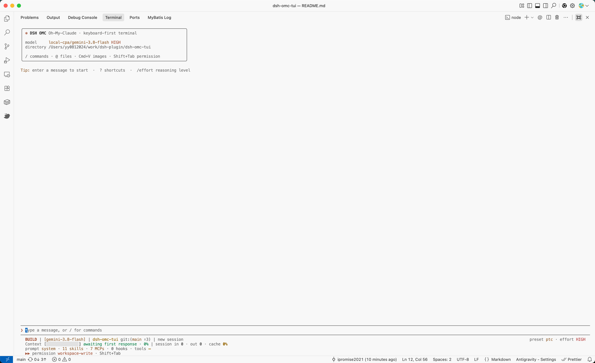

# DSH OMC TUI

<div align="center">

[](https://github.com/ipromise2021/dsh-omc-tui)
[](LICENSE)
[](https://github.com/deepseek-ai/deepseek-harness)
[](package.json)

**DeepSeek Harness 的终端原生 TUI**

保留终端 Scrollback，提供自主决策视觉 Subagent、多模态图片直贴、行内审批、Plan/Jobs、模型选择和上下文状态栏。

[架构与全功能实现](ARCHITECTURE.md) · [界面与设计说明](PRODUCT_SHOWCASE.md) · [兼容性记录](HARNESS_COMPATIBILITY.md) · [变更日志](CHANGELOG.md)

</div>



`dsh-omc-tui` 是面向 [DeepSeek Harness](https://github.com/deepseek-ai/deepseek-harness) 的 ANSI 终端界面插件。

插件专注于终端渲染与键盘交互；模型、会话、工具、权限、后台任务及持久化均由 Harness 官方服务提供。

个人比较喜欢 Claude Code 终端的交互方式，项目参考了它的交互习惯，在终端中运行 DSH 的同时，完整保留了原生滚轮回看、文本划选与自由复制等功能特性。

> 📌 **项目说明与动态**：
> - **版本基准与适配**：本插件目前主要基于 DSH `v0.1.1-rc.2` 版本进行开发与验证。由于此前 DSH 官方仓库的提交记录一直显示停留在上周，因此当前插件主要基于上一个版本做好了底层适配；对于近期官方新增的一系列提交，后续有时间会持续跟进仓库的新版本，积极做好底层接口与功能的适配工作。
> - **官方审核状态**：本插件已在官方插件列表提交，目前仍在等待官方审核中（暂无法确定具体的审核完成时间），审核通过前推荐直接通过 npm 或 GitHub 命令快速安装体验。
> - **持续维护**：功能会按需扩展，Bug 也会持续修复。欢迎使用、点 Star 和反馈问题。

## 插件功能

### 保留终端 Scrollback

不进入备用屏幕。对话、工具调用、Thinking 和 Diff 会追加到终端普通缓冲区，可以直接滚动回看和选择复制。

### Harness 原生集成

会话恢复、Plan 模式、权限审批、Jobs、Skills、模型和图片附件都使用 Harness 官方服务与 durable event。TUI 只负责展示和交互。

### 智能视觉 Subagent（全自动自主决策识别）

deepseek-v4-pro/flash等纯文本模型，不具备直接接收多模态图片的能力。传统方案往往要求用户**手动切换全局模型**、**手动调用特定技能/插件**，或在外部识别后再复制文本，严重打断编程思路。

`dsh-omc-tui` 插件实现了 **零手动干预的自主旁路视觉架构（说人话就是子代理，主agent会自主分配给该代理执行）**：

- **图片无感直贴**：支持在终端直接按 `Cmd/Ctrl+V` 粘贴 macOS 剪贴板图片，或通过 iTerm2 OSC 1337、Kitty Graphics 协议直接发送图片。图片通过 Harness Attachment 管道自动管理与落盘。
- **Agent 自主决策调用**：**用户无需手动使用技能、无需手动执行插件命令，也无需临时切换主模型**。主 Agent（纯文本/代码模型）在接收到带图片上下文的提问时，会结合当前任务意图**自主判断**何时需要读取图片，并在需要时自动触发底层的 `analyze_image` 视觉工具。
- **瞬时旁路 Sidecar Subagent**：TUI 在后台动态拉起一个隔离的临时视觉 Subagent，定向解析图像细节、提取 OCR / UI 布局信息后立即销毁。
- **主会话无缝协同**：视觉识别结果以标准工具结果形式返回给主 Agent，主模型保持原有的模型身份、推理链与上下文记忆继续处理任务，既享受了主模型的纯粹代码推理能力，又获得了强大的多模态感知。

> **💡 视觉子代理模型与 API Key 配置提示**：
> - **使用 DeepSeek API 订阅**：推荐直接配置 `deepseek-v4-flash-vision-exp` 模型（执行 `/vision deepseek-official/deepseek-v4-flash-vision-exp`）。此时子代理与主模型**共用同一套 DeepSeek API Key，无需额外更换或配置新的 Key**。
> - **使用其他供应商视觉模型**：若子代理希望调用其他提供商（如 OpenAI `gpt-5.6-luna`、Qwen 等），只需在 DSH 中配置好对应供应商的 API Key，再执行 `/vision <provider>/<model>`（或直接输入 `/vision` 查看常用路由推荐）绑定子代理视觉模型即可。

### 行内审批与问题面板

文件修改和命令执行可在终端内查看 Diff 并选择允许或拒绝。Harness 的单选、多选和自由文本问题也可以直接在 TUI 中完成。

### 自适应状态栏

状态栏可以显示（参考了claude-hud插件的风格）：

- 当前模型、Plan/Build 模式和权限档位
- 会话累计 Context 进度与水位预警
- Git 分支、工作区变更和 ahead/behind 状态
- 最近工具、Skills、MCP、Hooks 和 Jobs
- 最近一次响应速度与耗时

支持 `detailed`、`compact` 和 `minimal` 三种密度。

### 常用终端工作流

- `@文件`：浏览并引用工作区文件
- `/btw`：使用独立临时会话回答旁路问题
- `/compact`：调用 Harness 压缩当前会话上下文
- `!命令`：执行本地 Shell 命令
- `/jobs`：查看和取消后台任务
- `/resume`：恢复历史会话
- `/steer`：运行中调整当前任务方向

## 环境要求

- Node.js 20 或更高版本
- DeepSeek Harness `0.1.1-rc.2`
- 支持 ANSI 256 色的终端
- 图片显示建议使用 iTerm2 或支持 Kitty Graphics 的终端

目前主要在 macOS、VS Code Terminal 和 iTerm2 中开发与验证。

## 安装和启动

从 npm 安装到 `tui` profile（推荐，直接分发构建产物，无需 Git 依赖构建授权）：

```sh
npx --yes @deepseek-ai/dsh@latest plugin --profile tui add dsh-omc-tui
```

也可以从 GitHub 安装（会拉取源码，首次需按 pnpm 提示授权 `prepare` 构建脚本）：

```sh
npx --yes @deepseek-ai/dsh@latest plugin --profile tui add github:ipromise2021/dsh-omc-tui
```

启动：

```sh
npx --yes @deepseek-ai/dsh@latest --profile tui
```

如果已经全局安装 DSH，也可以直接运行：

```sh
dsh --profile tui
```

### 💡 快捷启动别名（推荐）

日常使用与开发中，我更习惯在终端配置文件（如 `~/.zshrc` 或 `~/.bashrc`）中添加别名，直接输入 `dsh-omc-tui` 或 `omc` 快速启动（主要就是想少敲点键盘）：

```sh
# 添加到 ~/.zshrc 或 ~/.bashrc
alias dsh-omc-tui="dsh --profile tui"
alias omc="dsh --profile tui"
```

配置后，在任意工作目录下直接执行：

```sh
dsh-omc-tui
# 或
omc
```

### 本地开发安装

建议使用单独的 `DSH_HOME`，避免影响日常配置：

```sh
export DSH_HOME=/private/tmp/dsh-tui-dev
npx --yes @deepseek-ai/dsh@latest plugin --profile tui add /absolute/path/to/dsh-omc-tui
npx --yes @deepseek-ai/dsh@latest --profile tui
```

## 常用快捷键

| 按键 | 功能 |
| :--- | :--- |
| `Enter` | 发送消息或确认当前选项 |
| `Ctrl+J` | 输入多行内容 |
| `Ctrl+C` | 中断当前回合；空闲时退出 |
| `Ctrl+O` | 展开或折叠 Thinking 与工具组 |
| `Ctrl+P` | 打开命令面板 |
| `Ctrl+R` / `Ctrl+F` | 搜索输入历史 |
| `Ctrl+G` | 使用 `$EDITOR` 编辑 Prompt |
| `Shift+Tab` | 切换权限预设 |
| `Ctrl+B` | 将正在执行的 Bash 放入后台 |
| `Ctrl+V` | 粘贴文本或终端图片 |
| `@` | 打开文件引用补全 |
| `?` | 打开帮助面板 |

## 常用命令

| 命令 | 功能 |
| :--- | :--- |
| `/model` | 选择模型，并根据模型能力选择 reasoning effort |
| `/vision <provider>/<model>` | 配置 `analyze_image` 使用的旁路视觉模型 |
| `/provider` | 管理模型提供方、自定义端点和模型列表 |
| `/plan [off\|message]` | 进入或退出 Harness Plan 模式，可携带规划说明和图片 |
| `/status` | 查看会话、模型、Token 和扩展状态 |
| `/settings` | 设置主题、状态栏密度和 Context 预警 |
| `/new` | 使用当前模型、权限和预设创建新会话 |
| `/btw <问题>` | 在独立临时会话中提问，不加入主会话历史 |
| `/compact` | 压缩当前会话上下文 |
| `/jobs` | 查看后台任务、读取输出或取消任务 |
| `/skills` | 浏览并在 TUI Profile 中切换 Skill 的 on/off 状态 |
| `/resume` | 恢复当前工作目录下的历史会话 |
| `/rename <标题>` | 重命名当前会话 |
| `/mcp` / `/hooks` | 查看已挂载的 MCP 与 Hook 状态 |
| `/export` | 将当前会话导出为 Markdown |
| `/exit` | 安全退出终端（有活跃后台任务时弹出确认） |

其他命令和快捷键可以在 TUI 中通过 `?`、`/help` 或 `Ctrl+P` 查看。

## 主题和终端显示

内置以下主题：

- `claude`：暖色调
- `deepseek`：蓝色调
- `mono`：黑白模式
- `light`：浅色模式

终端宽度、ANSI 控制序列、中文、emoji 和组合字符由本地渲染器处理，不依赖 Ink、Blessed、Chalk 或其他重型终端 UI 库。

## 项目结构

```text
src/
├── commands/    内置命令
├── core/        事件、Git 和基础工具
├── input/       输入编辑与补全
├── panels/      审批、模型、Jobs、Skills 等面板
├── renderer/    ANSI、Markdown、Transcript 和 Statusline
└── index.js     TUI 控制器与终端事件循环
```

更完整的架构说明见 [PRODUCT_SHOWCASE.md](PRODUCT_SHOWCASE.md)，Harness 接口适配情况见 [HARNESS_COMPATIBILITY.md](HARNESS_COMPATIBILITY.md)。

## 开发与验证

```sh
npm test
npm run verify
```

如果准备了不含凭据的 Harness 测试夹具，还可以运行 PTY 集成测试：

```sh
DSH_TEST_FIXTURE_HOME=/path/to/dsh-home npm run test:pty
```

## 安全看门狗 (Danger Guard) 与安全边界

`dsh-omc-tui` 内置了原生安全看门狗（Dangerous-Command Watchdog），在 Harness 的 `tools/pre-execute` 执行前切入点进行结构化语法审查与单调阻断（Deny-or-Abstain），防止模型或子代理意外执行高破坏性命令。

### 1. 内置防护覆盖矩阵

| 平台 / 工具 | 结构化拦截的危险操作模式 |
| :--- | :--- |
| **Unix / Linux / macOS** (`bash`, `sh`, `zsh` 等) | `rm -rf /`、`rm -rf ~`（含多层相对路径越界 `a/../../b`、通配符与变量展开）<br>`chmod -R 777 /`、`find / -delete`、`find / -exec rm ...`<br>`mkfs.*`、`fdisk`、`dd of=/dev/sd*` 直写磁盘设备<br>`git push --force`（保护 remote 分支，安全选项 `--force-with-lease` 正常放行）<br>`:(){ :|:& };:` 等 Fork 炸弹 |
| **Windows** (`pwsh`, `powershell`, `cmd`) | `Remove-Item -Recurse -Force C:\`、`del /f /s /q C:\*`、`rd /s /q C:\`<br>`Clear-Disk`、`Initialize-Disk`、`Format-Volume`<br>`format C:` 磁盘格式化驱动器<br>`powershell -EncodedCommand` 混淆载荷还原审查 |
| **Shell 封装与深层混淆** | `sudo`、`env`、`exec`、`timeout`、`sh -c`、`bash -lc`、`cmd /c` 组合解构<br>ANSI-C `$'\x72\x6d'` / `$'\u0072\u006d'` / `$'\162\155'` 转义还原<br>深层嵌套子 Shell（`depth > 32`）与超长输入（`> 128KB`）采用 Fail-Closed 默认阻断 |

### 2. 自定义规则配置 (`.dsh/danger-rules.json`)

可在当前项目根目录或配置路径放置 `.dsh/danger-rules.json` 扩展自定义规则：

```json
{
  "enabled": true,
  "block": [
    "DROP\\s+DATABASE",
    "kubectl\\s+delete\\s+namespace"
  ],
  "allow": [
    "^git status$",
    "^npm test$"
  ]
}
```

- `block`：扩展自定义高危正则表达式（命中即拦截）。
- `allow`：强制基于全段锚定（`^(?:pattern)$`）放行安全白名单，杜绝子串或子 Shell 注入逃逸。
- 完全停用：设置环境变量 `DSH_DANGER_GUARD=off` 即可停用看门狗。

### 3. 威胁模型与安全边界说明

> [!IMPORTANT]
> **安全边界提示**：
> 1. Danger Guard 定位于 Agent 工具执行前的**启发式防误操作防线**，专注于拦截模型误触发的破坏性指令；
> 2. 静态分析无法穷尽所有动态构造（如运行时管道下载脚本 `curl | sh`、图灵完备混淆）；
> 3. **必须叠加使用 Harness 权限预设（Permission Presets）、沙箱隔离（Docker / Container / MicroVM）与生产凭据管控**，切勿将纯静态守卫视为唯一的安全沙箱。

## 当前限制

- 项目仍处于 pre-release 阶段，Harness 上游接口变化后可能需要同步适配。
- Windows 和更多真实模型提供方仍需要进一步验证。
- `/plugins`、`/fork`、`/rewind` 等能力暂未在 TUI 中实现。
- 本插件只提供 TUI；模型、工具、Sandbox 和会话持久化由 DSH profile 提供。

## 反馈与贡献

个人开发的开源项目，以实际终端使用体验为基础，按需开发、持续完善。欢迎使用、点 Star，也欢迎反馈 Bug 和提出功能建议。

如果遇到问题，可以提交 [Issue](https://github.com/ipromise2021/dsh-omc-tui/issues)。建议附上 DSH 版本、Node.js 版本、操作系统、终端类型和复现步骤。也欢迎直接提交 PR。

提交代码前请运行：

```sh
npm test
npm run verify
```

提交信息建议使用 Conventional Commits，例如 `feat:`、`fix:`、`docs:`。

## License

[MIT](LICENSE)
